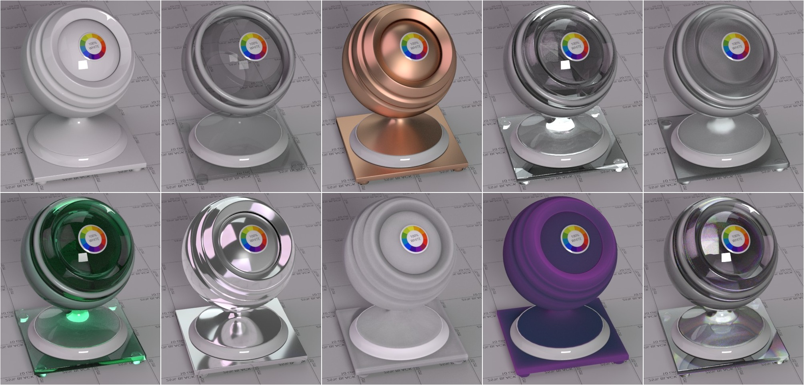

# PhyShader

Physical plausible, easy to use, compact surface shader for Mantra renderer.



## Features
* VOP type operator
* Energy conserving
* Microfacet-based BSDF's
* Anisotropy
* Conductor Fresnel
* Volume absorption
* Subsurface scattering
* Translucency
* Dispersion
* Thin sheet dielectric
* Transparent shadows
* Shader nesting
* Extra image planes support
* and more...

##Installation
Copy `vex`,`otls` and `gallery` folders into your Houdini home directory.

If you have troubles with asset loading, try to rebuild the otl.
You can do it manually with command:

`hotl -c expanded-otl otls/physhader.otl`

or use provided scripts:

### Linux
```
make
make install
```

### Windows
`install.bat`

## Quickstart
1. Go to Material Palette
2. Choose PhySurface Simple and move material into the scene
3. Assign material to the object
4. Adjust parameters
5. ...
6. RENDER

## Advanced usage
[Wiki](../../wiki/Home) (In progress)
